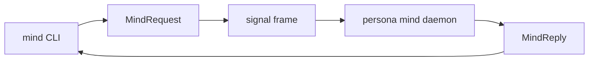
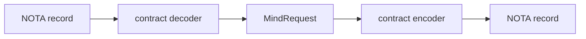

# signal-mind — architecture

*Typed Signal contract for the command-line mind and `mind`.*

## 0 · TL;DR

`signal-mind` is the public vocabulary for Persona's central mind. It
defines the typed request/reply channel used by the `mind` CLI and long-lived
`mind` daemon. The current contract includes the typed mind graph, typed
technical dependency memory, the work-and-memory graph, and channel
choreography observation.

## Contract/Daemon Boundary

This contract names the public operations a caller sends to Mind. The daemon
lowers those operations into Nexus commands and SEMA reads or writes behind the
boundary; database-action classes are not public request roots.

**Contract operations on the wire (this crate).** The wire uses
`signal-frame` contract-local operations directly; there is no universal
verb-class wrapper in `MindRequest`. The current operation roots remain
relation-specific:

- *Typed mind graph relation:* `Submit` (for `SubmitThought`,
  `SubmitRelation` — already verb-form; payloads are `Thought` /
  `Relation`), `Query` (lift the repeated `Query*` siblings into one
  `Query` operation root whose payload names the read target).
- *Typed technical dependency memory:* `Submit` covers `TechnicalNode`
  and `TechnicalRelation`; `Query` and domain-local subscriptions read
  technical dependency state. `TechnicalNode` / `TechnicalRelation` are
  separate contract shapes, not `ThoughtBody` variants. Callers provide
  stable `TechnicalNodeKey` values; `mind` mints compact node and relation
  identifiers.
- *Work-and-memory graph:* `Submit` covers `Opening`,
  `NoteSubmission` (rename payload to `Note`), `Link`, and
  `AliasAssignment` (payload `AliasAssignment`); status changes use the
  contract-local `StatusChange` operation.
- *Channel choreography:* this contract keeps Router-to-Mind
  adjudication observation and read-side channel views only. Router
  channel authority orders are not ordinary Mind working requests.
  `Grant`, `Extend`, `Revoke`, and `Deny` live in
  `meta-signal-router`, the router's meta signal, and are
  called by Orchestrate. Mind decides at the cognitive level and
  orders Orchestrate through `meta-signal-orchestrate`. The
  remaining Mind-side verbs are `Adjudicate` (open an adjudication for
  resolution; replaces `AdjudicationRequest`) and `Query` (read the
  channel list; replaces `ChannelList`).

**Mandatory `Tap`/`Untap` for persona components.** Persona-mind is a
persona component, so its observable surface is standardized.
Replace the existing subscription pairs (`SubscribeThoughts`,
`SubscribeRelations`, `SubscriptionRetraction`) with the
macro-injected `Tap(ObserverFilter)` /
`Untap(MindObserverSubscriptionToken)` for the standardized observer
hook. If domain-specific watch surfaces are still needed (e.g.
streaming Thought commits to a specific subscriber set), they can
keep domain-local `Watch`/`Unwatch` verbs alongside the mandatory
observability.

**Component commands (mind daemon).** The mind
daemon owns its typed Command enum. Example commands:
`MindCommand::AssertThought`, `MindCommand::AssertRelation`,
`MindCommand::ReadThoughtIndex`, `MindCommand::RecordOpening`,
`MindCommand::ChangeWorkItemStatus`,
`MindCommand::RecordAdjudicationRequest`, and
`MindCommand::ReadChannelList`. Router channel authority commands live
behind Orchestrate's machinery path:
`meta-signal-orchestrate` → `meta-signal-router`,
not this working signal.

**Frame layer.** The dependency is `signal-frame`.

References:
- `primary/skills/contract-repo.md` §"Public contracts use contract-local operation verbs"

> **Scope.** This contract sits on today's stack — `signal-frame` wire,
> rkyv archives, `sema-db` storage in consumers. The
> eventually-self-hosting stack is Sema-on-Sema, in which signal-*
> as a separate vocabulary layer collapses. Today's contract is a
> realization step. See `~/primary/ESSENCE.md` §"Today and eventually".

This repo owns records, validation newtypes, rkyv round trips, and channel
shape. It does not own the CLI binary, actors, database, storage tables,
transport lifecycle, or lock-file migration.

Each `MindRequest` variant is a contract-local operation. The daemon owns its
typed component commands, Nexus decisions, and SEMA reads or writes. Database
action classes do not appear on the wire and this contract has no
`signal-sema` dependency.



## 1 · Channel Boundary

| Side | Component |
|---|---|
| Request producer | `mind` CLI and future hosts that speak the same channel. |
| Request consumer | `mind` daemon. |
| Reply producer | `mind` daemon. |
| Reply consumer | the caller that submitted the operation. |

The CLI text surface is one NOTA record in and one NOTA record out. That text
projection must decode into the same `MindRequest` enum declared here. It must
not create a second CLI-only command language.

Rust-to-Rust boundaries use `signal-frame` frames carrying rkyv archives. The
same typed request/reply vocabulary underlies both the NOTA projection and the
binary frame projection.

The local transport between CLI and daemon belongs to `mind`, not this
contract. The likely first transport is a Unix socket carrying `signal-frame`
frames.

## 2 · Channel Declaration

The channel is one `signal_channel!` invocation in `src/lib.rs`.

```rust
signal_channel! {
    channel Mind {
        operation SubmitThought(SubmitThought),
        operation SubmitRelation(SubmitRelation),
        operation QueryThoughts(QueryThoughts),
        operation QueryRelations(QueryRelations),
        operation SubscribeThoughts(SubscribeThoughts) opens MindEventStream,
        operation SubscribeRelations(SubscribeRelations) opens MindEventStream,
        operation SubscriptionRetraction(SubscriptionIdentifier),
        operation Opening(Opening),
        operation NoteSubmission(NoteSubmission),
        operation Link(Link),
        operation StatusChange(StatusChange),
        operation AliasAssignment(AliasAssignment),
        operation Query(Query),
        operation AdjudicationRequest(AdjudicationRequest),
        operation ChannelList(ChannelList),
        operation SubmitTechnicalNode(SubmitTechnicalNode),
        operation SubmitTechnicalRelation(SubmitTechnicalRelation),
        operation QueryTechnicalNodes(QueryTechnicalNodes),
        operation QueryTechnicalRelations(QueryTechnicalRelations),
        operation SubscribeTechnicalNodes(SubscribeTechnicalNodes) opens MindEventStream,
        operation SubscribeTechnicalRelations(SubscribeTechnicalRelations) opens MindEventStream,
        reply MindReply {
            ThoughtCommitted(ThoughtCommitted),
            RelationCommitted(RelationCommitted),
            ThoughtList(ThoughtList),
            RelationList(RelationList),
            SubscriptionAccepted(SubscriptionAccepted),
            SubscriptionRetracted(SubscriptionRetracted),
            OpeningReceipt(OpeningReceipt),
            NoteReceipt(NoteReceipt),
            LinkReceipt(LinkReceipt),
            StatusReceipt(StatusReceipt),
            AliasReceipt(AliasReceipt),
            View(View),
            Rejection(Rejection),
            AdjudicationReceipt(AdjudicationReceipt),
            ChannelListView(ChannelListView),
            MindRequestUnimplemented(MindRequestUnimplemented),
            TechnicalNodeCommitted(TechnicalNodeCommitted),
            TechnicalRelationCommitted(TechnicalRelationCommitted),
            TechnicalNodeList(TechnicalNodeList),
            TechnicalRelationList(TechnicalRelationList),
            TechnicalNodeRejected(TechnicalNodeRejected),
            TechnicalRelationRejected(TechnicalRelationRejected),
        }
        event MindEvent {
            SubscriptionDelta(SubscriptionEvent) belongs MindEventStream,
        }
        stream MindEventStream {
            token SubscriptionIdentifier;
            opened SubscriptionAccepted;
            event SubscriptionDelta;
            close SubscriptionRetraction;
        }
    }
}
```

Closed enums are intentional. There is no `Unknown` escape hatch. New
operations are schema changes coordinated through this contract.

The request enum exposes one contract-owned discriminant:

- `operation_kind()` names the domain operation for audit and UI surfaces.

The contract names the caller's domain action. The daemon decides what internal
command, durable read, durable write, effect, rejection, or reply the action
becomes.

## 3 · Record Families

### 3.1 Typed mind graph substrate

| Request | Reply |
|---|---|
| `SubmitThought` | `ThoughtCommitted` |
| `SubmitRelation` | `RelationCommitted` |
| `QueryThoughts` | `ThoughtList` |
| `QueryRelations` | `RelationList` |
| `SubscribeThoughts` | `SubscriptionAccepted`, then `SubscriptionDelta` events, terminated by `SubscriptionRetracted` |
| `SubscribeRelations` | `SubscriptionAccepted`, then `SubscriptionDelta` events, terminated by `SubscriptionRetracted` |

Subscription close follows the `signal_channel!` streaming grammar. The
`Subscribe` request opens the stream; the consumer sends a typed
`MindRequest::SubscriptionRetraction(SubscriptionIdentifier)` request to close it;
the producer emits `MindReply::SubscriptionRetracted` as the final
acknowledgement before the stream ends. Both the retract request and the
retracted reply are first-class — `signal_channel!` derives the
`MindRequest::closed_stream()` discriminant from this pairing.

The graph surface is the first typed substrate for replacing BEADS and later
rendering reports/architecture/skills from mind state. The closed node family
is `ThoughtKind`: `Observation`, `Memory`, `Belief`, `Goal`, `Claim`,
`Decision`, `Reference`. The closed edge family is `RelationKind`:
`Implements`, `Realizes`, `Requires`, `Supports`, `Refutes`, `Supersedes`,
`Authored`, `References`, `Decides`, `Considered`, `Belongs`.

`RelationKind` owns the domain/range validator for this graph vocabulary. The
validator is contract code, not runtime folklore: producers and consumers call
the same table before accepting a relation. The full endpoint validator also
checks relation-specific body constraints; `Authored` requires a source Thought
whose body is `Reference(Identity)`, not just any Reference.

`RecordIdentifier` and `RelationIdentifier` are opaque contract values. `mind` owns
their minting, collision handling, durable indices, and short display-id
projection. The contract owns only the typed records that cross the channel.

### 3.2 Work and memory graph

| Request | Reply |
|---|---|
| `Opening` | `OpeningReceipt` |
| `NoteSubmission` | `NoteReceipt` |
| `Link` | `LinkReceipt` |
| `StatusChange` | `StatusReceipt` |
| `AliasAssignment` | `AliasReceipt` |
| `Query` | `View` |

These records are the active native replacement for BEADS as a work/memory
graph. Imported BEADS IDs are represented as aliases or external references;
the contract does not model a live BEADS backend.

### 3.3 Typed technical dependency memory

| Request | Reply |
|---|---|
| `SubmitTechnicalNode` | `TechnicalNodeCommitted` or `TechnicalNodeRejected` |
| `SubmitTechnicalRelation` | `TechnicalRelationCommitted` or `TechnicalRelationRejected` |
| `QueryTechnicalNodes` | `TechnicalNodeList` |
| `QueryTechnicalRelations` | `TechnicalRelationList` |
| `SubscribeTechnicalNodes` | `SubscriptionAccepted`, then `SubscriptionDelta` events, terminated by `SubscriptionRetracted` |
| `SubscribeTechnicalRelations` | `SubscriptionAccepted`, then `SubscriptionDelta` events, terminated by `SubscriptionRetracted` |

Technical dependency memory is the first production slice for Mind as a typed
technical memory sibling to Spirit. It models components, repositories, crates,
contracts, work items, source artifacts, reports, technical claims, and
witnesses as `TechnicalNode` records. Dependency edges are `TechnicalRelation`
records with closed relation kinds: `OwnsRepository`, `DefinesContract`,
`DefinesCrate`, `DependsOn`, `Blocks`, `Implements`, `UsesContract`,
`UsesStorage`, `Documents`, `DerivedFrom`, `ClaimsAbout`, `ProvenBy`,
`Supersedes`, and `LocatedAt`.

`TechnicalNodeKey` is the stable public key callers use to name a technical
node across submissions and filters. `TechnicalNodeIdentifier` and
`TechnicalRelationIdentifier` are compact daemon-minted identifiers returned in
committed records and query results. Submit requests do not carry compact IDs,
authors, timestamps, or sequence numbers.

`TechnicalNodeKind` owns the body-kind validator. `TechnicalRelationKind` owns
the domain/range validator for relation endpoints. Rejection reasons are typed:
kind/body mismatch, duplicate stable node key, duplicate relation, missing
endpoint, domain/range violation, and persistence rejection.

### 3.4 Channel choreography

| Request | Reply |
|---|---|
| `AdjudicationRequest` | `AdjudicationReceipt` |
| `ChannelList` | `ChannelListView` |

These records are the typed working boundary between `persona-router`
and `mind` for channel choreography observation. Router parks a
message whose channel is missing or inactive and submits
`AdjudicationRequest`. Mind records the request and may inspect channel
views through `ChannelList`. If Mind decides router channel policy
should change, it orders Orchestrate through
`meta-signal-orchestrate`. Orchestrate then sends `Grant`,
`Extend`, `Revoke`, or `Deny` through
`meta-signal-router`. Mind does not call Router's meta
signal directly.

The destination handler set inside `mind` is a stateful
`ChoreographyAdjudicator` actor that owns the adjudication log and any
Mind-side policy reasoning. It does not own the router's live grant
table. `AdjudicationRequest` and `ChannelList` route to that actor; it
answers with the receipt or view reply. Until that actor lands, mind
replies `MindRequestUnimplemented(ChoreographyPolicyMissing)` for this
family.

The endpoint and kind vocabulary is typed:

- `ChannelEndpoint` is either `Internal(ComponentName)` or
  `External(ConnectionClass)`.
- `ChannelMessageKind` is a closed enum for first-stack route categories such
  as message submission, inbox query, message delivery, terminal input, prompt
  observation, and adjudication. **Includes
  `MessageIngressSubmission`** — the channel kind for the
  `Internal(Message) → Internal(Router)` structural channel that
  `persona-message-daemon` forwards user-typed messages over. This
  variant must be distinct from the generic delivery kinds so audit and
  choreography can tell message ingress from other internal traffic.
- Meta-order names such as channel grant, extension, revocation, and
  denial are intentionally absent from `ChannelMessageKind`; those are
  operations on `meta-signal-router`, not routed message
  categories in the Mind working signal.
- `ChannelDuration` is `OneShot`, `Permanent`, or `TimeBound(TimestampNanos)`.

## 4 · Boundary Newtypes

The contract validates boundary strings before they become wire values.

| Type | Invariant |
|---|---|
| `RoleName` | closed role set plus canonical wire-token parsing/rendering: operator, operator-assistant, second-operator-assistant, designer, designer-assistant, second-designer-assistant, system-specialist, system-assistant, second-system-assistant, poet, poet-assistant. |
| `WirePath` | absolute normalized slash-separated path; rejects `..`. |
| `TaskToken` | raw unbracketed token, non-empty, no whitespace or brackets. |
| `TimestampNanos` | store-supplied timestamp type; request records do not mint it. |
| `ActorName` | event/caller identity after infrastructure resolution. |
| `RecordIdentifier` | opaque durable thought identifier minted by `mind`. |
| `RelationIdentifier` | opaque durable relation identifier minted by `mind`. |
| `StableItemIdentifier` | internal work graph identity. |
| `DisplayIdentifier` | short human identity for work graph references. |
| `ExternalAlias` | imported or external identifiers. |
| `AdjudicationRequestIdentifier` | short router-minted identifier for one parked adjudication request. |
| `TechnicalNodeIdentifier` | compact daemon-minted technical node identifier. |
| `TechnicalRelationIdentifier` | compact daemon-minted technical relation identifier. |
| `TechnicalNodeKey` | stable caller-visible technical node key used for submissions and filters. |
| `ChannelEndpoint` | typed internal/external route endpoint using `signal-persona-origin`. |
| `ChannelMessageKind` | closed set of first-stack route categories. |
| `ChannelDuration` | channel lifetime requested or emitted by mind choreography. |

Strings in `Title`, `Body`, and path-like wrappers are provisional where the
semantic shape is still evolving. They are still typed at the boundary; callers
do not pass unstructured maps.

## 5 · Text Projection

The required text surface is NOTA. Nexus may supply the semantic content shape
inside NOTA, but there is no second text syntax.

The contract records implement NOTA directly. Root `MindRequest` and
`MindReply` text decoding dispatches through `signal_frame::signal_channel!`;
payload records derive or implement NOTA in this crate. Validating boundary
newtypes such as `WirePath` and `TaskToken` decode through their constructors,
so text input cannot bypass boundary validation.



Representative contract text shapes:

```text
(Query (Ready) 25)
(Opening Task High [wire command-line mind] [replace lock helper with typed state])
(AdjudicationRequest [adjudication-aab] (External (Owner)) (Internal Router) MessageSubmission [owner asks router to deliver a prompt])
```

Surface owners decide where this NOTA is accepted or rendered. This crate owns
the codec on the contract types, and the parsed value is one of the
`MindRequest` or `MindReply` variants declared here.

## 6 · Versioning

`signal-frame::Frame` carries protocol version. Schema changes that add/remove
variants or change fields require coordinated upgrades of producers and
consumers.

Backward compatibility is handled by explicit conversion code, not by weak
catch-all records.

## 6.5 · Skeleton honesty (Unimplemented reply)

`MindReply` carries a typed `MindRequestUnimplemented(MindUnimplementedReason)`
variant. Prototype-time mind decodes every `MindRequest` variant; for choreography
ops or other variants whose behavior is not yet built, mind replies
`MindRequestUnimplemented(NotInPrototypeScope)` — a typed answer, not a panic
and not a parse error.

```text
MindUnimplementedReason
  | NotInPrototypeScope                  -- variant exists in contract; behavior not yet built
  | ChoreographyPolicyMissing            -- specific reason for the choreography family
  | DependencyMissing(DependencyKind)     -- Router, Harness, Terminal, DurableStore
  | ResourceUnavailable(ResourceKind)     -- SocketPath, StateDirectory, Database
```

## 7 · Constraints

- The channel is one closed `MindRequest` enum and one closed `MindReply`
  enum emitted by `signal_channel!`. All variants are contract-local
  operations; SEMA reads, writes, and classifications are daemon-side only.
- The architecture's channel declaration matches the implemented
  `signal_channel!` invocation in `src/lib.rs`.
- `RoleName` covers every workspace coordination role in
  `~/primary/orchestrate/AGENTS.md`.
- Request payloads do not mint `ActorName`, `TimestampNanos`, `EventSeq`,
  `OperationIdentifier`, stable item IDs, display IDs, compact technical node
  IDs, or compact technical relation IDs.
- Technical dependency memory is modeled as `TechnicalNode` /
  `TechnicalRelation`, not as another `ThoughtBody` variant.
- `TechnicalNodeKey` is public and stable; compact technical node and relation
  identifiers are daemon-minted.
- Lock files and BEADS are represented only as temporary external references or
  aliases, never as live backend protocol.
- Channel choreography records use `signal-persona-origin` endpoint and origin
  types; they do not carry proof material.
- Channel choreography is closed vocabulary; there is no stringly "kind" or
  catch-all request.
- Router channel authority orders are absent from this working signal
  and live in `meta-signal-router`, called by Orchestrate.
- `ChannelMessageKind` does not contain meta-order names such as
  channel grant, extension, revocation, or denial.
- This contract crate contains no CLI, daemon, actor runtime, database table,
  transport, or migration implementation.
- The text surface is NOTA projected into these exact records; there is no
  second command language.
- Subscription close uses the streaming grammar: a typed subscription request opens
  the stream; a typed `SubscriptionRetraction(SubscriptionIdentifier)`
  request closes it; the producer emits `MindReply::SubscriptionRetracted`
  as the final acknowledgement before the stream ends.
- Channel-choreography requests route inside `mind` to one stateful
  `ChoreographyAdjudicator` actor; this contract closes the Mind-side
  observation vocabulary, and Router meta signal owns grant-state
  authority orders.

## 8 · Tests

Existing tests in `tests/round_trip.rs` cover:

- request/reply frame round trips;
- representative NOTA text round trips for root requests and replies:
  `Query`, `Opening`, and `AdjudicationRequest`;
- memory/work variants;
- every `QueryKind`;
- every `EdgeKind`;
- channel choreography request/reply variants;
- absence of router owner-order names from `ChannelMessageKind`;
- typed unimplemented reason variants;
- `MessageIngressSubmission` distinct from generic `MessageSubmission`;
- scope variants;
- external references;
- boundary validation, including `WirePath` NOTA decode rejection.
- workspace role coverage.
- relation-kind domain/range validation and table coverage.
- technical node/relation kind NOTA round trips, kind/body validation, relation
  domain/range validation, request/reply/event frame round trips, and operation
  head coverage.

Additional architecture guards still worth adding:

| Test | Proves |
|---|---|
| `nota_projection_rejects_cli_only_command` | no second command language. |
| `request_payload_cannot_carry_timestamp` | store mints time. |
| `request_payload_cannot_carry_event_sequence` | store mints sequence. |
| `contract_crate_cannot_spawn_actor_runtime` | contract crate stays behavior-free. |
| `subscription_retracted_round_trips_as_reply` | Path A reply-side close is wired in `MindReply` and `MindEventStream::close`. |

## 9 · Non-ownership

This repo does not own:

- `mind` binary implementation;
- Kameo actors;
- `mind.sema`;
- daemon lifecycle and local socket path;
- `sema` table declarations;
- caller identity resolution policy;
- time/ID minting policy;
- lock-file migration workflow;
- BEADS import code.

## Code Map

```text
src/lib.rs              shared newtypes and signal_channel! declaration
src/graph.rs            Thought/Relation graph records and subscription snapshot/delta shapes
src/technical.rs        TechnicalNode/TechnicalRelation records, filters, validators, replies
tests/round_trip.rs     frame round trips, NOTA witnesses, and validation tests
```

## See Also

- `../mind/ARCHITECTURE.md`
- `../meta-signal-router/ARCHITECTURE.md`
- `../signal-frame/ARCHITECTURE.md`
- `~/primary/orchestrate/AGENTS.md`
- `~/primary/skills/contract-repo.md`
- `~/primary/skills/component-triad.md`.
